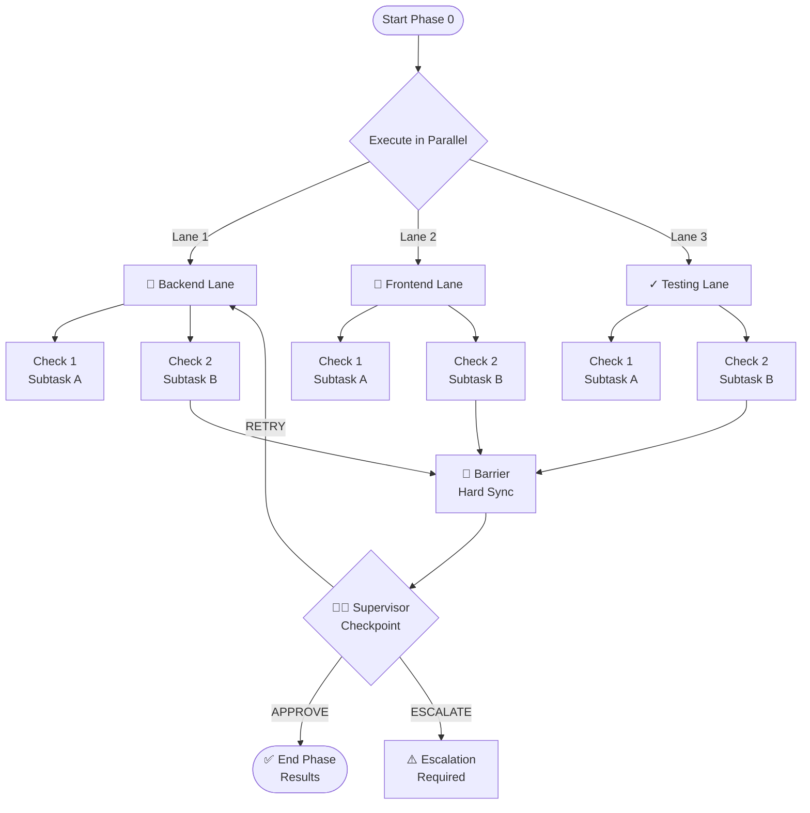

# DAG Definition & Orchestration

**Status**: ✅ Implemented | **Priority**: P0 | **Roadmap**: Core  
**Related**: Agent Types, Check Handlers, Model Routing

## Overview

The DAG (Directed Acyclic Graph) orchestration system is the heart of ai-agencee/ai-kit. It enables **declarative, JSON-based definition of multi-agent workflows** that execute in parallel with built-in supervision, error handling, and cost tracking.

### Key Capabilities

- **Parallel execution** — Multiple agent lanes run simultaneously
- **Supervisor checkpoints** — Typed validation gates between phases
- **JSON-declarative** — No code required for DAG topology
- **Type-safe TypeScript** — Full TypeScript support with inference
- **Real-time streaming** — Live output and event tracking
- **Cost enforcement** — Per-run budget caps and tracking

---

## Core Concepts

### DAG Structure

A DAG consists of:

1. **Lanes** — Parallel execution contexts (Backend, Frontend, QA)
2. **Checks** — Individual tasks (validation, generation, review)
3. **Barriers** — Synchronization gates between phases
4. **Supervisors** — Validation rules at checkpoints



---

## Quick Start

### 1. Define Your DAG

Create `agents/my-workflow.dag.json`:

```json
{
  "$schema": "../../schemas/dag.schema.json",
  "name": "my-workflow",
  "budgetUSD": 5.00,
  "lanes": [
    {
      "id": "backend",
      "displayName": "Backend Team",
      "icon": "⚙️",
      "checks": [
        {
          "id": "code-review",
          "type": "llm-review",
          "taskType": "code-review",
          "path": "src/backend",
          "prompt": "Review this TypeScript backend for type safety and performance.",
          "model": "sonnet",
          "pass": "✅ Code review passed"
        }
      ]
    },
    {
      "id": "frontend",
      "displayName": "Frontend Team",
      "icon": "🎨",
      "checks": [
        {
          "id": "ui-review",
          "type": "llm-review",
          "taskType": "code-review",
          "path": "src/frontend",
          "prompt": "Review React components for accessibility and performance.",
          "model": "sonnet",
          "pass": "✅ UI review passed"
        }
      ]
    }
  ],
  "barriers": [
    {
      "id": "post-review",
      "type": "hard",
      "dependsOn": ["backend", "frontend"]
    }
  ],
  "supervisor": {
    "checkpointLevel": "APPROVE",
    "escalationPolicy": "onAnyFailure"
  }
}
```

### 2. Execute the DAG

```bash
# Via CLI
ai-kit agent:dag agents/my-workflow.dag.json

# Via TypeScript
import { DagOrchestrator } from '@ai-agencee/engine';

const orchestrator = new DagOrchestrator(projectRoot);
const result = await orchestrator.execute(dagDefinition, {
  budgetUSD: 5.00,
  streaming: true,
  printCostSummary: true
});
```

### 3. Access Results

```typescript
// Lane results
result.lanes.forEach(lane => {
  console.log(`Lane: ${lane.id}`);
  lane.checks.forEach(check => {
    console.log(`  Check: ${check.id} → ${check.status}`);
    console.log(`  Output: ${check.output}`);
  });
});

// Summary
console.log(`Total Cost: $${result.costSummary.totalUSD}`);
console.log(`Status: ${result.status}`); // 'success' | 'failure' | 'escalated'
```

---

## Configuration Reference

### DAG Definition

```typescript
interface DagDefinition {
  // Metadata
  name: string;
  description?: string;
  version?: string;
  
  // Execution constraints
  budgetUSD: number;
  maxDurationMs?: number;
  timeoutPolicy?: 'fail' | 'escalate';
  
  // Topology
  lanes: LaneDefinition[];
  barriers?: BarrierDefinition[];
  supervisor?: SupervisorConfig;
  
  // Optional features
  eventBus?: boolean;
  persistMemory?: boolean;
  auditLog?: boolean;
}

interface LaneDefinition {
  // Identity
  id: string;
  displayName: string;
  icon?: string;
  
  // Execution
  checks: CheckDefinition[];
  dependsOn?: string[];
  
  // Routing
  provider?: 'anthropic' | 'openai' | 'mock' | 'ollama';
  modelFamily?: 'haiku' | 'sonnet' | 'opus';
  
  // Supervision
  supervisor?: IntraSupervisorConfig;
  
  // Authorization
  rbacPolicy?: RbacPolicy;
}

interface CheckDefinition {
  id: string;
  type: 'file-exists' | 'grep' | 'llm-review' | 'llm-generate' | 'run-command' | /* ... */;
  taskType?: string;
  
  // Input/Output
  path?: string;
  prompt?: string;
  outputKey: string;
  
  // Validation
  pass?: string;
  fail?: string;
  
  // Model selection
  model?: 'haiku' | 'sonnet' | 'opus';
  temperature?: number;
  maxTokens?: number;
}

interface BarrierDefinition {
  id: string;
  type: 'soft' | 'hard';
  dependsOn: string[];
  timeout?: number;
  escalateOnTimeout?: boolean;
}

interface SupervisorConfig {
  checkpointLevel: 'VALIDATE' | 'APPROVE' | 'ESCALATE';
  escalationPolicy: 'onAnyFailure' | 'onMajorityFailure' | 'onCriticalOnly';
  verdictTimeout?: number;
  humanReviewRequired?: boolean;
}
```

### Lane Configuration

Each lane runs **independently and in parallel**:

```json
{
  "id": "backend",
  "displayName": "Backend Implementation",
  "checks": [
    {
      "id": "api-design",
      "type": "llm-review",
      "taskType": "architecture-decision",
      "path": "src/api",
      "prompt": "Review API design for RESTful compliance and versioning strategy.",
      "model": "opus",
      "outputKey": "api_review",
      "pass": "✅ API design approved"
    },
    {
      "id": "generate-tests",
      "type": "llm-generate",
      "taskType": "code-generation",
      "prompt": "Generate comprehensive unit tests for the API layer.",
      "model": "sonnet",
      "maxTokens": 4000,
      "outputKey": "test_code",
      "pass": "✅ Tests generated"
    }
  ]
}
```

### Barrier Types

**Soft Barrier** — Allows some lanes to fail:
```json
{
  "id": "soft-wait",
  "type": "soft",
  "dependsOn": ["backend", "frontend"],
  "percentageRequired": 75
}
```

**Hard Barrier** — All lanes must succeed:
```json
{
  "id": "hard-gate",
  "type": "hard",
  "dependsOn": ["backend", "frontend", "testing"],
  "escalateOnTimeout": true,
  "timeout": 300000
}
```

---

## Examples

### Example 1: Code Review Workflow

Review code across multiple domains in parallel:

```json
{
  "name": "code-review-workflow",
  "budgetUSD": 3.00,
  "lanes": [
    {
      "id": "backend-review",
      "displayName": "Backend Code Review",
      "checks": [
        {
          "type": "llm-review",
          "taskType": "code-review",
          "path": "src/api",
          "prompt": "Review for type safety, error handling, and performance. Flag any async/await issues.",
          "model": "sonnet",
          "outputKey": "backend_issues"
        }
      ]
    },
    {
      "id": "frontend-review",
      "displayName": "Frontend Code Review",
      "checks": [
        {
          "type": "llm-review",
          "taskType": "code-review",
          "path": "src/components",
          "prompt": "Review React components for accessibility (a11y), performance, and hooks usage.",
          "model": "sonnet",
          "outputKey": "frontend_issues"
        }
      ]
    },
    {
      "id": "security-review",
      "displayName": "Security Review",
      "checks": [
        {
          "type": "llm-review",
          "taskType": "security-review",
          "path": "src",
          "prompt": "Security audit: Check for common vulnerabilities, secrets exposure, authentication issues.",
          "model": "opus",
          "outputKey": "security_findings"
        }
      ]
    }
  ],
  "barriers": [
    {
      "id": "all-reviews-done",
      "type": "hard",
      "dependsOn": ["backend-review", "frontend-review", "security-review"]
    }
  ]
}
```

### Example 2: Feature Implementation with Phases

```json
{
  "name": "feature-implementation",
  "budgetUSD": 10.00,
  "lanes": [
    {
      "id": "architecture",
      "displayName": "Architecture Design",
      "checks": [
        {
          "type": "llm-generate",
          "taskType": "architecture-decision",
          "prompt": "Design the system architecture for a real-time notification system.",
          "model": "opus",
          "outputKey": "architecture_design"
        }
      ]
    },
    {
      "id": "backend",
      "displayName": "Backend Implementation",
      "dependsOn": ["architecture"],
      "checks": [
        {
          "type": "llm-generate",
          "taskType": "code-generation",
          "prompt": "Implement the backend API based on the architecture design.",
          "model": "sonnet",
          "outputKey": "backend_code"
        }
      ]
    },
    {
      "id": "frontend",
      "displayName": "Frontend Implementation",
      "dependsOn": ["architecture"],
      "checks": [
        {
          "type": "llm-generate",
          "taskType": "code-generation",
          "prompt": "Implement the React frontend for the notification system.",
          "model": "sonnet",
          "outputKey": "frontend_code"
        }
      ]
    }
  ],
  "barriers": [
    {
      "id": "implementation-complete",
      "type": "hard",
      "dependsOn": ["backend", "frontend"]
    }
  ]
}
```

---

## Execution Model

### Phase Execution

When a DAG executes, it progresses through phases:

```
1. INIT
   └─ Load DAG, validate schema, initialize event bus

2. LANES_PARALLEL
   └─ Execute all lane.checks in parallel (via Promise.allSettled)

3. BARRIER
   └─ Wait for lanes to complete, check barrier conditions

4. SUPERVISOR
   └─ Run supervisor checkpoint verdicts (APPROVE/RETRY/ESCALATE)

5. RESULTS
   └─ Aggregate results, calculate costs, emit final events
```

### Error Handling

Each lane has a built-in **retry policy**:

```typescript
interface RetryPolicy {
  maxAttempts: number;
  initialDelayMs: number;
  backoffMultiplier: number;
  maxDelayMs: number;
}

// Default
{
  maxAttempts: 3,
  initialDelayMs: 1000,
  backoffMultiplier: 2,
  maxDelayMs: 30000
}
```

Failed checks trigger supervisor handoff:

```
Check Fails
  │
  ├─→ Retry policy kicks in
  │     ├─ Attempt 1: immediate
  │     ├─ Attempt 2: 1s delay
  │     └─ Attempt 3: 2s delay
  │
  └─→ All retries exhausted
        │
        └─→ Supervisor verdict:
              ├─ APPROVE (allow failure)
              ├─ RETRY (extended backoff)
              └─ ESCALATE (human review or fail)
```

---

## Cost Tracking

Every check's LLM call is tracked:

```typescript
interface CostSummary {
  totalUSD: number;
  
  perLane: Record<string, LaneCost>;
  perProvider: Record<string, ProviderCost>;
  perModel: Record<string, ModelCost>;
  
  breakdown: {
    promptTokens: number;
    completionTokens: number;
    totalTokens: number;
  };
}

// Example output
{
  "totalUSD": 2.47,
  "perLane": {
    "backend": { "tasks": 2, "costUSD": 1.23, "tokens": 4200 },
    "frontend": { "tasks": 1, "costUSD": 0.82, "tokens": 2800 },
    "security": { "tasks": 1, "costUSD": 0.42, "tokens": 1400 }
  },
  "perModel": {
    "sonnet": { "costUSD": 2.05, "tasks": 3 },
    "opus": { "costUSD": 0.42, "tasks": 1 }
  }
}
```

Budget enforcement:

```json
{
  "budgetUSD": 5.00,
  "lanes": [ /* ... */ ]
}

// If cost exceeds budget:
// DAG execution halts, error reported, remaining lanes cancelled
```

---

## Monitoring & Events

Subscribe to DAG events:

```typescript
import { getGlobalEventBus } from '@ai-agencee/engine';

const bus = getGlobalEventBus();

bus.on('dag:start', (event) => console.log('DAG started:', event.runId));
bus.on('lane:start', (event) => console.log(`Lane ${event.laneId} started`));
bus.on('check:complete', (event) => console.log(`Check ${event.checkId}:`, event.status));
bus.on('barrier:complete', (event) => console.log('Barrier reached:', event.barrierId));
bus.on('dag:end', (event) => console.log('DAG complete:', event.status, `$${event.costUSD}`));
```

---

## Troubleshooting

### DAG won't start
- **Check**: JSON schema validation — run `ai-kit agent:validate agents/my.dag.json`
- **Check**: Budget is positive — ensure `budgetUSD > 0`
- **Check**: At least one lane exists — `lanes` array must not be empty

### Lanes execute sequentially instead of parallel
- **Verify**: No `dependsOn` on external lanes (should only depend on barriers)
- **Check**: Event bus isn't blocking execution

### Budget exceeded mid-execution
- **Reduce** `maxTokens` per check
- **Switch** to cheaper models (Haiku instead of Opus)
- **Increase** `budgetUSD` or split workflow

### Supervisor keeps escalating
- **Review** supervisor `checkpointLevel` — may be too strict
- **Check** if upstream lanes are failing
- **Enable** human review: `humanReviewRequired: true`

---

## Related Features

- [Agent Types & Roles](./02-agent-types-roles.md) — How lanes are staffed
- [Check Handlers](./04-check-handlers.md) — Available check types
- [Model Routing](./03-model-routing-cost.md) — Model selection strategy
- [Streaming Output](./05-streaming-output.md) — Real-time token output
- [Event Bus](./08-event-bus.md) — Event subscriptions

---

**Last Updated**: March 5, 2026 | **Version**: 1.0.0
