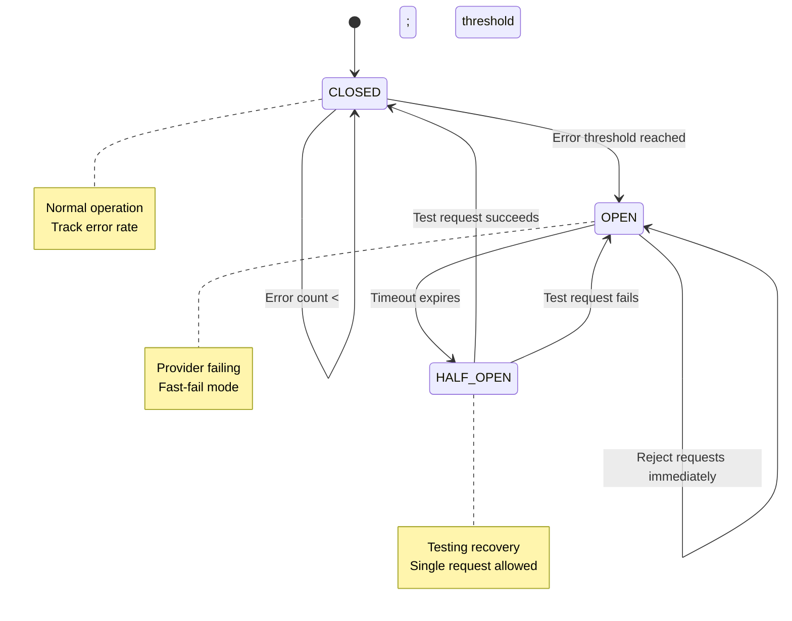

# Resilience Patterns: Retry & Circuit Breaker

**Status**: ✅ Implemented | **Priority**: P1 | **Roadmap**: G-10, G-11, G-12  
**Related**: Model Routing, Event Bus

## Overview

Resilience patterns protect against transient failures (network blips, rate limiting) and cascading failures (provider outages). They enable **self-healing workflows** that gracefully degrade rather than fail completely.

### Key Capabilities

- **Exponential backoff retry** — Intelligent retry with increasing delays
- **Circuit breaker pattern** — Stop retrying a failing provider
- **Timeout management** — Prevent indefinite hangs
- **Graceful fallback** — Switch to alternative provider on failure
- **Budget-aware retry** — Don't retry if over budget
- **Retry observability** — Track retry patterns for analysis

---

## Core Concepts

### Retry Policy

```typescript
interface RetryPolicy {
  // Attempt control
  maxAttempts: number;              // Total attempts (including initial)
  initialDelayMs: number;           // First retry delay
  maxDelayMs: number;               // Cap on delay growth
  
  // Backoff strategy
  backoffMultiplier: number;        // Growth factor: 2 = exponential
  backoffJitter: boolean;           // Add randomness to reduce thundering herd
  
  // Retry conditions
  retryableErrors: string[];        // Error codes to retry (e.g., 429, 500, 503)
  nonRetryableErrors: string[];     // Never retry these (e.g., 400, 401, 404)
  
  // Constraints
  maxTotalDurationMs?: number;      // Stop retrying after total time
  respectRateLimitHeaders?: boolean;// Use Retry-After header
}

// Default policy (exponential backoff)
{
  maxAttempts: 3,
  initialDelayMs: 1000,             // 1 second
  maxDelayMs: 30_000,               // 30 seconds
  backoffMultiplier: 2,              // Double each retry
  backoffJitter: true,               // Add randomness
  retryableErrors: ['429', '500', '502', '503', '504'],
  respectRateLimitHeaders: true
}
```

### Circuit Breaker States



---

## Quick Start

### 1. Enable Retry Policy

```json
{
  "name": "resilient-workflow",
  "lanes": [
    {
      "id": "backend",
      "checks": [
        {
          "id": "api-review",
          "type": "llm-review",
          "prompt": "Review API",
          "retryPolicy": {
            "maxAttempts": 3,
            "initialDelayMs": 1000,
            "backoffMultiplier": 2,
            "respectRateLimitHeaders": true
          }
        }
      ]
    }
  ]
}
```

### 2. Enable Circuit Breaker

```json
{
  "name": "protected-workflow",
  "lanes": [
    {
      "id": "backend",
      "provider": "anthropic",
      "circuitBreaker": {
        "enabled": true,
        "failureThreshold": 5,
        "successThreshold": 2,
        "timeoutMs": 60000,
        "monitorWindow": 300000
      }
    }
  ]
}
```

### 3. Execute with Fallback

```bash
# Automatically falls back provider if primary fails
ai-kit agent:dag agents/resilient-workflow.dag.json

# Output shows retries and fallbacks
# [Attempt 1/3] API call to Anthropic...
# ❌ Failed: 429 Too Many Requests
# ⏳ Backoff: waiting 1000ms before retry
# [Attempt 2/3] Retrying API call...
# ❌ Failed: 429 Too Many Requests
# ⏳ Backoff: waiting 2000ms before retry
# [Attempt 3/3] Retrying API call...
# ✅ Success: 1247 tokens
```

---

## Configuration Reference

### Retry Policy

```typescript
interface RetryPolicy {
  // Attempts
  maxAttempts: number;
  
  // Backoff calculation
  initialDelayMs: number;
  maxDelayMs: number;
  backoffMultiplier: number;      // 1 = no backoff, 2 = exponential
  backoffJitter: boolean;          // Add ±randomness%
  
  // Retry conditions
  retryableErrors: string[];
  nonRetryableErrors: string[];
  shouldRetry?: (error: Error) => boolean;  // Custom logic
  
  // Duration limits
  maxTotalDurationMs?: number;
  timeoutPerAttempt?: number;
  
  // Provider-specific
  respectRateLimitHeaders: boolean; // Use Retry-After header
  respectRetryAfter: boolean;       // Respect provider's retry guidance
}
```

### Circuit Breaker Configuration

```typescript
interface CircuitBreakerConfig {
  // Enable/disable
  enabled: boolean;
  
  // Failure detection
  failureThreshold: number;        // Failures before opening
  failureWindow?: number;          // Rolling window (ms)
  
  // Recovery
  successThreshold: number;        // Successes to close from half-open
  timeoutMs: number;               // Time in OPEN before trying half-open
  
  // Monitoring
  monitorWindow: number;           // Watch errors over this period
  
  // Actions
  onOpen?: () => void;             // Called when circuit opens
  onClose?: () => void;            // Called when circuit closes
  onHalfOpen?: () => void;         // Called when entering half-open
}
```

---

## Examples

### Example 1: Aggressive Retry for Transient Errors

For rate-limited providers (retry aggressively):

```json
{
  "id": "aggressive-retry",
  "type": "llm-review",
  "retryPolicy": {
    "maxAttempts": 5,
    "initialDelayMs": 500,
    "maxDelayMs": 60000,
    "backoffMultiplier": 2.5,
    "backoffJitter": true,
    "retryableErrors": ["429", "500", "502", "503", "504", "TIMEOUT"],
    "respectRateLimitHeaders": true,
    "maxTotalDurationMs": 300000
  }
}
```

**Timeline**:

```mermaid
gantt
    title Exponential Backoff Retry Timeline
    dateFormat HH:mm:ss
    
    section Attempts
    Attempt 1 :done, 00:00:00, 100ms
    Wait 500ms :crit, 00:00:00, 500ms
    Attempt 2 :done, 00:00:01, 100ms
    Wait 1250ms :crit, 00:00:01, 1250ms
    Attempt 3 :done, 00:00:02, 100ms
    Wait 3125ms :crit, 00:00:02, 3125ms
    Attempt 4 :done, 00:00:05, 100ms
    Wait 7125ms :crit, 00:00:05, 7125ms
    Attempt 5 :done, 00:00:12, 100ms
    Max timeout :milestone, 00:01:00, 1m
```


**Detailed breakdown**:
```
Attempt 1: 0s        - Try now
Attempt 2: 0.5s      - Wait 500ms
Attempt 3: 1.75s     - Wait 1250ms (500×2.5)
Attempt 4: 4.875s    - Wait 3125ms (1250×2.5)
Attempt 5: 12s       - Wait 7125ms (3125×2.5)
Max time: 60s (respects rate limit headers)
```

### Example 2: Circuit Breaker with Fallback

```typescript
const dag = new DagBuilder('fault-tolerant')
  .lane('backend')
    .provider('anthropic')
    .check('api-review')
      .type('llm-review')
      .prompt('Review API')
      .model('sonnet')
      .retryPolicy({
        maxAttempts: 3,
        initialDelayMs: 1000,
        backoffMultiplier: 2
      })
      .circuitBreaker({
        enabled: true,
        failureThreshold: 5,
        timeoutMs: 60000,
        successThreshold: 2
      })
      .output('review')
    .end()
  .end()
  
  // Fallback lane if Anthropic circuit opens
  .lane('backend-fallback')
    .provider('openai')
    .check('api-review-openai')
      .type('llm-review')
      .prompt('Review API')
      .model('gpt-4')
      .output('review_fallback')
    .end()
  .end()
  
  .build();
```

### Example 3: Bulkhead Pattern (Per-Provider Limits)

```json
{
  "name": "rate-limited-workflow",
  "lanes": [
    {
      "id": "batch-processing",
      "provider": "anthropic",
      "concurrencyLimit": 3,
      "circuitBreaker": {
        "enabled": true,
        "failureThreshold": 10,
        "timeoutMs": 120000
      },
      "checks": [
        {
          "id": "check-1",
          "type": "llm-review",
          "retryPolicy": {
            "maxAttempts": 4,
            "initialDelayMs": 2000,
            "backoffMultiplier": 2
          }
        }
      ]
    }
  ]
}
```

---

## Backoff Strategies

### Exponential Backoff

```
Attempt 1: 0ms
Attempt 2: 1000ms × 2^0 = 1s
Attempt 3: 1000ms × 2^1 = 2s
Attempt 4: 1000ms × 2^2 = 4s
Attempt 5: 1000ms × 2^3 = 8s

Total: 15 seconds
```

```typescript
const policy = {
  maxAttempts: 5,
  initialDelayMs: 1000,
  backoffMultiplier: 2
};
```

### Linear Backoff

```
Attempt 1: 0ms
Attempt 2: 1000ms
Attempt 3: 2000ms
Attempt 4: 3000ms
Attempt 5: 4000ms

Total: 10 seconds
```

```typescript
const policy = {
  maxAttempts: 5,
  initialDelayMs: 1000,
  backoffMultiplier: 1  // No growth
};
```

### Exponential + Jitter

Prevents thundering herd (all clients retrying simultaneously):

```
Attempt 1: 0ms
Attempt 2: 1000ms ± 500ms = 500-1500ms
Attempt 3: 2000ms ± 1000ms = 1000-3000ms
Attempt 4: 4000ms ± 2000ms = 2000-6000ms
```

```typescript
const policy = {
  maxAttempts: 4,
  initialDelayMs: 1000,
  backoffMultiplier: 2,
  backoffJitter: true  // Enable randomness
};
```

---

## Retry-After Headers

Providers send hints on when to retry:

```http
HTTP/1.1 429 Too Many Requests
Retry-After: 60
```

Configuration respects these:

```json
{
  "retryPolicy": {
    "respectRateLimitHeaders": true,
    "respectRetryAfter": true
  }
}
```

**Behavior**:
1. Get 429 with `Retry-After: 60`
2. Instead of exponential backoff (2s, 4s, 8s...), wait 60s
3. Retry after exactly 60 seconds
4. More efficient than blind backoff

---

## Failure Types

### Retryable Errors

```
429 — Too Many Requests (rate limit)
500 — Internal Server Error (temporary)
502 — Bad Gateway (upstream issue)
503 — Service Unavailable (maintenance)
504 — Gateway Timeout (too slow)
TIMEOUT — Request took too long
ECONNRESET — Connection dropped
ECONNREFUSED — Provider not responding
```

### Non-Retryable Errors

```
400 — Bad Request (bad input, won't change)
401 — Unauthorized (auth failed, won't work)
403 — Forbidden (access denied, won't work)
404 — Not Found (resource doesn't exist)
```

### Custom Retry Logic

```typescript
const policy = {
  shouldRetry: (error: Error) => {
    // Retry only on specific conditions
    if (error.code === 'TIMEOUT') return true;
    if (error.code === '429') return true;
    if (error.message.includes('rate limit')) return true;
    return false;
  }
};
```

---

## Monitoring Retry Behavior

### Retry Events

```typescript
orchestrator.on('retry:attempt', (event) => {
  console.log(`Attempt ${event.attemptNumber}/${event.maxAttempts}`);
  console.log(`  Error: ${event.lastError.message}`);
  console.log(`  Next backoff: ${event.nextDelayMs}ms`);
});

orchestrator.on('retry:success', (event) => {
  console.log(`✅ Success on attempt ${event.attemptNumber}`);
  console.log(`  Total time: ${event.totalDurationMs}ms`);
});

orchestrator.on('retry:exhausted', (event) => {
  console.log(`❌ Retries exhausted after ${event.attemptNumber} attempts`);
  console.log(`  Total time: ${event.totalDurationMs}ms`);
});
```

### Circuit Breaker Events

```typescript
orchestrator.on('circuitbreaker:open', (event) => {
  console.warn(`🔴 Circuit opened for ${event.provider}`);
  console.warn(`  Failures: ${event.failureCount} in ${event.windowMs}ms`);
});

orchestrator.on('circuitbreaker:halfopen', (event) => {
  console.log(`🟡 Testing recovery for ${event.provider}`);
});

orchestrator.on('circuitbreaker:closed', (event) => {
  console.log(`🟢 Circuit closed for ${event.provider}`);
});
```

### Retry Statistics

```typescript
const stats = await orchestrator.getRetryStats(runId);

console.log(`Total retries: ${stats.totalRetries}`);
console.log(`Successful retries: ${stats.successfulRetries}`);
console.log(`Failed retries: ${stats.failedRetries}`);
console.log(`Avg retry time: ${stats.avgRetryDurationMs}ms`);

// Per-provider breakdown
Object.entries(stats.byProvider).forEach(([provider, data]) => {
  console.log(`${provider}: ${data.retries} retries, ${data.successRate}% success`);
});
```

---

## Best Practices

### 1. Match Backoff to Domain

- **Fast APIs** (< 100ms typical latency): Start with 100ms backoff
- **Slow APIs** (> 1s typical latency): Start with 1-2s backoff
- **Rate-limited APIs**: Start with 5-10s backoff

### 2. Cap Total Time

```typescript
{
  maxAttempts: 5,
  maxTotalDurationMs: 60000  // Never retry longer than 1 minute
}
```

### 3. Use Jitter for Scale

At scale, jitter prevents thundering herd:

```typescript
{
  backoffJitter: true  // Enable for multi-instance deployments
}
```

### 4. Monitor Circuit Breaker Trips

```typescript
orchestrator.on('circuitbreaker:open', (event) => {
  alertSlack(`⚠️ Circuit open for ${event.provider}`);
});
```

### 5. Set Realistic Timeouts

```typescript
{
  timeoutPerAttempt: 30000,    // 30s per attempt
  maxTotalDurationMs: 120000   // 2 minutes total
}
```

---

## Troubleshooting

### "Retries taking too long"
- **Reduce** `maxAttempts` or `maxTotalDurationMs`
- **Lower** `maxDelayMs` cap
- **Check** if backoff is too conservative

### "Circuit breaker keeps opening"
- **Increase** `failureThreshold` (fewer failures needed to trip)
- **Increase** `timeoutMs` (more time before testing recovery)
- **Investigate** why provider is failing

### "Never retrying when it should"
- **Verify** error is in `retryableErrors` list
- **Check** `shouldRetry` callback logic
- **Ensure** retry limit not already exceeded

---

## Related Features

- [Model Routing](./03-model-routing-cost.md) — Uses retries for failover
- [Event Bus](./08-event-bus.md) — Emits retry events
- [Cost Tracking](./03-model-routing-cost.md) — Counts retries against budget

---

**Last Updated**: March 5, 2026 | **Version**: 1.0.0
