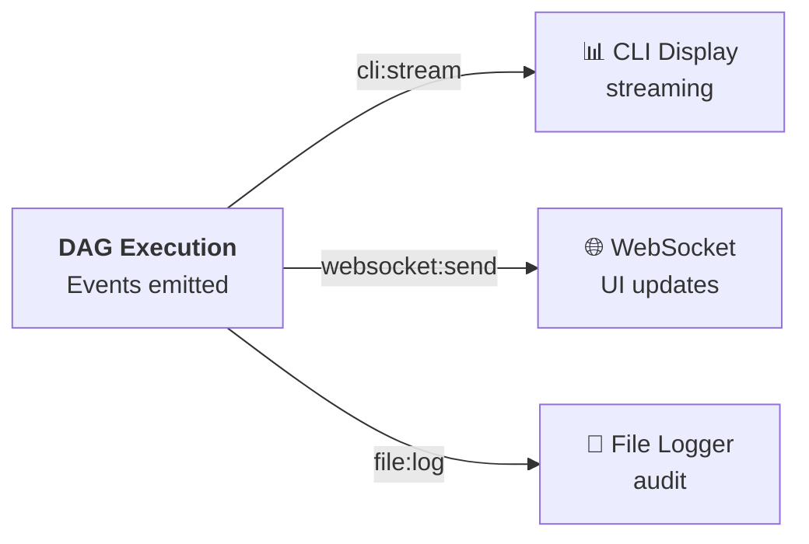

# Event Bus & Real-Time Events

**Status**: ⏳ In Progress | **Priority**: P1 | **Roadmap**: G-14, G-28  
**Related**: Streaming Output, Real-time Dashboard, Resilience Patterns

## Overview

The typed event bus enables **real-time subscription** to DAG execution events. External systems can subscribe to lane updates, cost changes, tool calls, and verdicts without polling.

### Key Capabilities

- **Typed event emitter** — Full TypeScript support, no string keys
- **Real-time subscriptions** — Subscribe to live execution
- **WebSocket ready** — Bridge events to web UIs
- **Event filtering** — Subscribe to specific event types
- **Backpressure handling** — Non-blocking event writes
- **Event history** — Query recent events

---

## Core Concepts

### Event Bus Architecture



### Event Types

```typescript
// DAG lifecycle events
'dag:start'      // DAG execution began
'dag:end'        // DAG execution complete

// Lane events
'lane:start'     // Lane started (parallel)
'lane:end'       // Lane completed

// Check events
'check:start'    // Individual check started
'check:complete' // Check passed/failed
'check:error'    // Check threw exception

// Supervisor events
'supervisor:verdict'   // APPROVE / RETRY / ESCALATE
'barrier:reached'      // Barrier checkpoint hit

// Tool events
'tool:call'            // Tool was invoked
'tool:result'          // Tool returned result
'tool:error'           // Tool failed

// Financial events
'cost:estimate'        // Pre-execution estimate
'cost:update'          // Cost increased
'budget:warning'       // Approaching limit
'budget:exceeded'      // Over budget

// Streaming events
'token:stream'         // LLM token received
'stream:start'         // Streaming started
'stream:end'           // Streaming complete
```

---

## Quick Start

### 1. Subscribe to Events

```typescript
import { getGlobalEventBus } from '@ai-agencee/ai-kit-agent-executor';

const bus = getGlobalEventBus();

// Subscribe to specific event
bus.on('check:complete', (event) => {
  console.log(`Check: ${event.checkId} → ${event.status}`);
  console.log(`Output: ${event.output}`);
});

// Subscribe to all events
bus.on('*', (event) => {
  console.log(`[${event.type}] ${JSON.stringify(event)}`);
});
```

### 2. Execute DAG (Events Fire)

```typescript
const orchestrator = new DagOrchestrator(projectRoot);
const result = await orchestrator.execute(dagDefinition);

// Events fire as execution progresses:
// ✓ dag:start
// ✓ lane:start (backend)
// ✓ check:start (api-review)
// ✓ token:stream (each token)
// ✓ check:complete (api-review)
// ✓ lane:end (backend)
// ✓ dag:end
```

### 3. Bridge to WebSocket (Real-time UI)

```typescript
import { WebSocketServer } from 'ws';
import { getGlobalEventBus } from '@ai-agencee/ai-kit-agent-executor';

const wss = new WebSocketServer({ port: 8080 });

wss.on('connection', (ws) => {
  const bus = getGlobalEventBus();
  
  // Forward all events to web client
  bus.on('*', (event) => {
    ws.send(JSON.stringify(event));
  });
});
```

---

## Configuration Reference

### Event Bus Options

```typescript
interface EventBusConfig {
  // Enable/disable
  enabled: boolean;
  
  // Event filtering
  includeEventTypes?: string[];  // Only emit these
  excludeEventTypes?: string[];  // Never emit these
  
  // Performance
  asyncEmit?: boolean;           // Non-blocking emits
  maxListeners?: number;         // Per-event limit
  
  // Debugging
  logEvents?: boolean;           // Log all emissions
  logLevel?: 'debug' | 'info' | 'warn' | 'error';
  
  // History
  keepHistory?: boolean;         // Store last N events
  historySize?: number;          // Keep this many events
}
```

### Subscribe Options

```typescript
interface SubscribeOptions {
  // Filtering
  filter?: (event: Event) => boolean;  // Only emit if true
  
  // Lifecycle
  once?: boolean;  // Only call once, then unsubscribe
  
  // Context
  context?: any;   // `this` binding
}
```

---

## Examples

### Example 1: Live Progress Display

```typescript
import { getGlobalEventBus } from '@ai-agencee/ai-kit-agent-executor';

const bus = getGlobalEventBus();
const laneStatus = new Map();

bus.on('lane:start', (event) => {
  laneStatus.set(event.laneId, {
    status: 'running',
    startTime: Date.now()
  });
  printStatus();
});

bus.on('lane:end', (event) => {
  laneStatus.set(event.laneId, {
    status: event.status,
    endTime: Date.now(),
    costUSD: event.costUSD
  });
  printStatus();
});

function printStatus() {
  console.clear();
  console.log('╔═══════════════════════════╗');
  for (const [laneId, data] of laneStatus) {
    const icon = data.status === 'running' ? '⏳' :
                 data.status === 'success' ? '✅' : '❌';
    console.log(`${icon} ${laneId}: ${data.status}`);
  }
  console.log('╚═══════════════════════════╝');
}

const orchestrator = new DagOrchestrator(projectRoot);
await orchestrator.execute(dagDefinition);
```

**Output**:
```
╔═══════════════════════════╗
⏳ backend: running
⏳ frontend: running
⏳ security: waiting
╚═══════════════════════════╝
```

### Example 2: Cost Tracking in Real-Time

```typescript
const bus = getGlobalEventBus();
let totalCost = 0;

bus.on('cost:update', (event) => {
  totalCost += event.incrementalCost;
  const percentage = (totalCost / event.budgetUSD) * 100;
  
  // Progress bar
  const filled = Math.round(percentage / 5);
  const empty = 20 - filled;
  console.log(`[${​'#'.repeat(filled)}${'-'.repeat(empty)}] $${totalCost.toFixed(2)} / $${event.budgetUSD}`);
});

bus.on('budget:warning', (event) => {
  console.warn(`⚠️ Budget warning at ${event.utilization}%`);
});

bus.on('budget:exceeded', (event) => {
  console.error(`❌ Budget exceeded: $${event.spent} / $${event.budget}`);
});
```

**Output**:
```
[###--------- ---] $1.23 / $5.00
[######---------- ] $2.45 / $5.00
⚠️ Budget warning at 75%
[#########---------] $4.50 / $5.00
[###########-------] $5.10 / $5.00
❌ Budget exceeded: $5.10 / $5.00
```

### Example 3: Tool Call Audit Trail

```typescript
const bus = getGlobalEventBus();
const tools = [];

bus.on('tool:call', (event) => {
  tools.push({
    name: event.toolName,
    params: event.parameters,
    time: new Date().toISOString()
  });
  console.log(`🔧 Tool: ${event.toolName}`);
  console.log(`   Params: ${JSON.stringify(event.parameters)}`);
});

bus.on('tool:result', (event) => {
  console.log(`✓ Result size: ${event.resultSize} bytes`);
});

bus.on('tool:error', (event) => {
  console.error(`✗ Error: ${event.error}`);
});

// Save to file
bus.on('dag:end', () => {
  fs.writeFileSync('tool-audit.json', JSON.stringify(tools, null, 2));
});
```

---

## Event Details

### dag:start

**Fired**: When DAG execution begins  
**Data**:
```typescript
{
  type: 'dag:start';
  runId: string;
  dagName: string;
  laneCount: number;
  budgetUSD: number;
  timestamp: string;
}
```

### lane:start / lane:end

**Fired**: When lane begins/ends execution  
**Data**:
```typescript
{
  type: 'lane:start' | 'lane:end';
  runId: string;
  laneId: string;
  displayName: string;
  status: 'running' | 'success' | 'failure';
  checkCount: number;
  timestamp: string;
  durationMs?: number;
  costUSD?: number;
}
```

### check:complete

**Fired**: When individual check finishes  
**Data**:
```typescript
{
  type: 'check:complete';
  runId: string;
  laneId: string;
  checkId: string;
  status: 'success' | 'failure' | 'escalated';
  output: string;
  tokens?: {
    input: number;
    completion: number;
  };
  costUSD?: number;
  durationMs: number;
  timestamp: string;
}
```

### supervisor:verdict

**Fired**: When supervisor makes a decision  
**Data**:
```typescript
{
  type: 'supervisor:verdict';
  runId: string;
  decision: 'APPROVE' | 'RETRY' | 'ESCALATE';
  reason: string;
  checkId?: string;
  timestamp: string;
}
```

### token:stream

**Fired**: Each token during streaming  
**Data**:
```typescript
{
  type: 'token:stream';
  runId: string;
  checkId: string;
  token: string;
  tokenIndex: number;
  timestamp: string;
}
```

---

## WebSocket Bridge

### Server Setup

```typescript
import { WebSocketServer } from 'ws';
import { DagOrchestrator, getGlobalEventBus } from '@ai-agencee/engine';

const wss = new WebSocketServer({ port: 8080 });
const orchestrator = new DagOrchestrator(projectRoot);

wss.on('connection', (ws) => {
  console.log('▶ Client connected');
  
  const bus = getGlobalEventBus();
  
  // Forward all events
  const handler = (event) => {
    ws.send(JSON.stringify(event));
  };
  
  bus.on('*', handler);
  
  ws.on('close', () => {
    bus.off('*', handler);
    console.log('▶ Client disconnected');
  });
});

// Start DAG execution
orchestrator.on('*', (event) => getGlobalEventBus().emit(event.type, event));
```

### Client Connection

```typescript
// React component
function DagMonitor() {
  const [events, setEvents] = useState([]);
  
  useEffect(() => {
    const ws = new WebSocket('ws://localhost:8080');
    
    ws.onmessage = (event) => {
      const data = JSON.parse(event.data);
      setEvents(prev => [...prev, data]);
    };
    
    return () => ws.close();
  }, []);
  
  return (
    <div>
      {events.map((e, i) => (
        <div key={i}>
          <strong>{e.type}</strong>: {JSON.stringify(e.data)}
        </div>
      ))}
    </div>
  );
}
```

---

## Event Filtering

### Only Subscribe to Specific Types

```typescript
const bus = getGlobalEventBus();

// Only cost events
bus.on('cost:*', (event) => {
  console.log(`Cost event: ${event.type}`);
});

// Only errors
bus.on('*:error', (event) => {
  console.error(`Error in ${event.type}`);
});

// Multiple patterns
['check:start', 'check:end', 'check:error'].forEach(type => {
  bus.on(type, (event) => {
    console.log(`Check event: ${event.type}`);
  });
});
```

### Custom Filter

```typescript
const bus = getGlobalEventBus();

// Only expensive checks
bus.on('check:complete', (event, filter) => {
  if (event.costUSD > 0.10) {
    console.warn(`Expensive check: ${event.checkId} = $${event.costUSD}`);
  }
});
```

---

## Event History

### Query Recent Events

```typescript
const bus = getGlobalEventBus();

// Get last N events
const lastEvents = await bus.getHistory({
  count: 10,
  eventType: 'check:complete',
  afterTimestamp: Date.now() - 60000  // Last minute
});

lastEvents.forEach(event => {
  console.log(`${event.timestamp}: ${event.checkId} → $${event.costUSD}`);
});
```

### Replay Events

```typescript
const bus = getGlobalEventBus();

// Replay last 5 check completions
const replayEvents = await bus.getHistory({
  count: 5,
  eventType: 'check:complete'
});

replayEvents.forEach(event => bus.emit(event.type, event));
```

---

## Monitoring Event Bus

### Event Rate

```typescript
const bus = getGlobalEventBus();
let eventCount = 0;

bus.on('*', () => eventCount++);

setInterval(() => {
  console.log(`Events/sec: ${eventCount}`);
  eventCount = 0;
}, 1000);
```

### Event Size

```typescript
const bus = getGlobalEventBus();

bus.on('*', (event) => {
  const size = JSON.stringify(event).length;
  console.log(`Event size: ${(size / 1024).toFixed(2)}KB`);
});
```

---

## Troubleshooting

### "Events not firing"
- **Check**: Event bus enabled in DAG config
- **Verify**: Listeners registered before DAG execution
- **Confirm**: Event type hasn't been filtered out

### "WebSocket connection closes unexpectedly"
- **Verify**: Server is still running
- **Check**: No unhandled exceptions on server
- **Monitor**: Event bus memory usage

### "Memory usage growing"
- **Disable** `keepHistory` if not needed
- **Reduce** `historySize` if storing events
- **Implement** event cleanup strategy

---

## Related Features

- [Streaming Output](./05-streaming-output.md) — Emits token events
- [Real-time Dashboard](./18-dashboard.md) — Consumes events for live UI
- [Audit Logging](./10-audit-logging.md) — Event storage for compliance

---

**Last Updated**: March 5, 2026 | **Version**: 1.0.0
